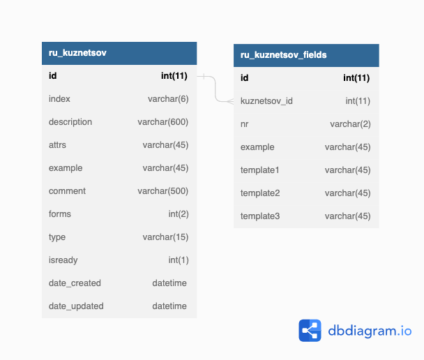

# Andmebaasi tabelite kirjeldus moodulite kaupa

1. [ Sõnade muutetüübid ](#inflections)
2. [ Muttetüüpide mallid ](#inflection_templates)
3. [ Kuznetsovi mallid ](#kuznetsov_templates)
4. [ Zaliznyak sõnastik ](#gramdict)
5. [ Hageni sõnastik ](#hagen_lemmas)
6. [ Ekilex sõnad  ](#ekilex_words)
7. [ Muudatustelogi ](#user_history)

## Sõnade muutetüübid

## Muttetüüpide mallid

## Kuznetsovi mallid

## Zaliznyak sõnastik

## Hageni sõnastik

## Ekilex sõnad 

## Muudatuste logi

**user_history**

| Column         | Data Type    | Nullable | Default           |                                                                                     |
|----------------|--------------|----------|-------------------|-------------------------------------------------------------------------------------|
| **id**         | int(11)      | No       | AUTO_INCREMENT    | rea id                                                                              |
| date_created   | datetime     | No       | CURRENT_TIMESTAMP | muudatuse aeg                                                                       |
| massaction_uid | varchar(36)  | Yes      | NULL              | massmuudatuste id (kui muudeti korraga mitu objekti)                                |
| username       | varchar(36)  | Yes      | NULL              | muutja                                                                              |
| object         | varchar(25)  | Yes      | NULL              | objekti tüüp (nt 'lemma', 'wordgamerow')                                            |
| object_uid     | varchar(100) | Yes      | NULL              | objekti uid                                                                         |
| action         | varchar(20)  | Yes      | NULL              | tegevus ['new', 'add', 'change', 'delete']                                          |
| field          | varchar(20)  | Yes      | NULL              | muudetud väli                                                                       |
| oldvalue       | mediumtext   | Yes      | NULL              | vana väärtus                                                                        |
| newvalue       | mediumtext   | Yes      | NULL              | uus väärtus                                                                         |
| revision       | int(11)      | Yes      | NULL              | pole kasutusel; TODO! eemaldada                                                     |
| reverted       | int(1)       | Yes      | NULL              | pole kasutusel; TODO! eemaldada                                                     |
| reverted_id    | varchar(36)  | Yes      | NULL              | kui muudatus on tagasikeeratud, siis tagasikeeramise muudatuse id                   |
| project        | varchar(10)  | Yes      | NULL              | pole kasutusel; TODO! eemaldada
| diff           | mediumtext   | Yes      | NULL              | muudatuste diff õpikukorpuste tektstide puhul                                       |
