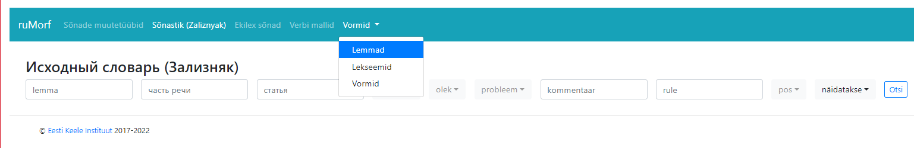
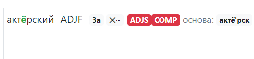

# Морфология русского языка в «Большом словаре Института эстонского языка» на портале Sõnaveeb

Продолжительность проекта: 2018 – 2024 
Руководитель проекта: Елена Каллас 
Техническая база: Катрин Цепелина 
Составители: Дона Волкова, Эдгар Сай, Ханна Таммик, Елена Каллас, Алина Смирнова, Ольга Кийсла 
База данных [ruMAB](https://arhiiv.eki.ee/keeletase/admin/rumorf/#!/rumorf/ekilexwordslist) 
Последнее обновление: 15.09.24

Одна из задач «Большого словаря Института эстонского языка» (EKI Ühendsõnastik) -
предоставить сведения о том, изменяемо ли слово, и если да, то как именно оно
склоняется или спрягается. Парадигмы словоизменения слов в словаре выглядят как
таблицы склонения или спряжения в Викисловаре. 
Для генерирования и проверки парадигм в институте в период с 2018 до 2024 года велась
работа над составлением базы данных, получившей название ruMAB, по аналогии с
морфологической базой эстонского языка, которая называется MAB (эст.
morfoloogiaandmebaas). По состоянию на 15 сентября 2024 года ruMAB содержит
информацию о словоизменении 119107 русских слов. В [Ekilex](https://ekilex.ee/) показываются парадигмы
для 69300 заголовочных единиц.

# ОПИСАНИЕ СТРУКТУРЫ БАЗЫ ДАННЫХ И ПРИНЦИПОВ ГЕНЕРИРОВАНИЯ ПАРАДИГМ

[**Модули базы данных ruMAB**](#модули-базы-данных-rumab) 
- [**Источники**](#источники)

[**Генерирование парадигм**](#генерирование-парадигм) 
- [**Частеречная разметка OpenCorpora**](#частеречная-разметка-opencorpora) 
- [**Атрибуты**](#атрибуты) 
- [**Таблицы парадигм**](#таблицы-парадигм)
- [**Условные сокращения и знаки (\*, \~)**](<#условные-сокращения-и-знаки-(*,-~)>) 

[**Существительные**](#существительные) 

[**Прилагательные**](#прилагательные) 

- [**Степени сравнения**](#степени-сравнения) 
[**Наречия и другие неизменяемые части речи**](#наречия-и-другие-неизменяемые-части-речи)

[**Глаголы**](#глаголы)

[**Причастия**](#причастия)

[**Деепричастия**](#деепричастия)

[**Числительные**](#числительные)

 

## Модули базы данных ruMAB

База данных состоит из нескольких модулей: Sõnade muuttüübid / Словарь парадигм, Sõnastik (Zaliznjak) / Исходный словарь (Зализняк), Ekilexi sõnad / Слова из Ekilex, Verbimallid / Шаблоны Кузнецова, Vormid / Морфологический анализ (см. рисунок 1).

<kbd></kbd> 
**Рисунок 1**. Модули базы данных ruMAB.

**Sõnade muuttüübid** / **Словарь парадигм** \- список слов, импортированный из базы данных словаря А. А. Зализняка [http://gramdict.ru/](http://gramdict.ru/), а также русские слова, которых не было в словаре А. А. Зализняка, но которые были зафиксированы в Бoльшом словаре EKI (EKI Ühendsõnastik) в базе данных Института эстонского языка EKILEX. Эти слова были импортированы в систему отдельным списком. По состоянию на 17.05.23 этот модуль содержит 131 583 слов. Для большинства слов сгенерированы парадигмы. Парадигмы могут быть проверены и привязаны к словам в Ekilex, могут быть не проверены, у части слов есть только индекс из словаря А. А. Зализняка. Список пополняется по мере генерирования парадигм слов, которые были зафиксированы в Бoльшом словаре EKI (EKI Ühendsõnastik) в базе данных Института эстонского языка Ekilex.

**Sõnastik (Zaliznjak)** / **Исходный словарь (Зализняк)** – изначальный список слов c индексом и [особыми пометами](http://gramdict.ru/howtouse#additional-symbols), импортированный из базы данных словаря А. А. Зализняка [http://gramdict.ru/](http://gramdict.ru/)

**Ekilexi sõnad** / **Слова из Ekilex \-** заголовочные слова в Большом словаре EKI (EKI Ühendsõnastik) в базе данных Института эстонского языка Ekilex. Этот модуль служит также для привязывания сгенерированной парадигмы с определённым словом в Ekilex (см. рисунок 2). По состоянию на 17.05.23 этот модуль содержит 76 424 слова.

<kbd></kbd> 
**Рисунок 2**. Заголовочное слово «собака» в модуле «Слова из Ekilex».

**Verbide mallid** / **Шаблоны Кузнецова** \- модуль, который использовался для генерирования парадигм глаголов на основе формообразовательного словаря-справочник С. А. Кузнецова. Система включает индекс подтипа, описание типа, статистику, сколько слов относится к определенному типу и сколько слов не имеют парадигмы. Всего 1116 типов.

**Vormid** / **Морфологический анализ** \- модуль позволяет извлечь из базы данных морфологическую характеристику для любой леммы или словоформы (см. рисунок 3).

<kbd></kbd> 
**Рисунок 3**. Морфологическая информация для леммы «идти» в модуле «Vormid» (формы).

### Источники

При составлении базы данных за основу были взяты следующие лексикографические источники и научные статьи:

1. Зализняк, А. А. 1977\. Грамматический словарь русского языка. Словообразование. Москва: Русский язык. Адрес в Интернете: [http://gramdict.ru/](http://gramdict.ru/) (15.05.23)
2. Хаген, М. Полная парадигма. Морфология. Частотный словарь. Совмещенный словарь (версия сентября 2020 года). Последняя редакция доступна для скачивания здесь: [http://speakrus.ru/dict2/index.htm](http://speakrus.ru/dict2/index.htm) (15.05.23)
3. Кузнецов, С. А. 2000\. Русский глагол. Формообразовательный словарь-справочник. Спб.: Норинт.
4. Окунева, А. П. 2000\. Русский глагол : словарь-справочник. Москва: Русский язык.
5. [Толковый словарь русского языка Дмитриева](https://dic.academic.ru/contents.nsf/dmitriev/). 2003\. Москва : Астрель
6. Ефремова, Т. Ф., Костомаров, В. Г. 2003\. Словарь грамматических трудностей русского языка. Москва.
7. Ляшевская, О. Н., Шаров, С. А. 2009\. Частотный словарь современного русского языка (на материалах Национального корпуса русского языка). М.: Азбуковник. Адрес в Интернете [http://dict.ruslang.ru/freq.php](http://dict.ruslang.ru/freq.php) (15.05.23)
8. Паликова, О., Кару, К. 2009\. Eesti asulanimede transkribeerimisest ja käänamisest vene keeles. – Eesti Rakenduslingvistika Ühingu aastaraamat, 5, 197-207. DOI:10.5128/ERYa5.13

Также использовались материалы орфографического академического ресурса «[Aкадемоc](http://orfo.ruslang.ru/)», порталов «[ГРАМОТА.РУ](http://gramota.ru/)» и «[Словари на Академике](https://dic.academic.ru/)» и Викисловаря.

Приводим краткое описание каждого из источников.

* **Зализняк, А. А. 1977\. Грамматический словарь русского языка. Словообразование. Москва: Русский язык. Адрес в Интернете: [http://gramdict.ru/](http://gramdict.ru/) (15.05.23)**

  В словаре А. А. Зализняка все слова имеют определённый тип словоизменения \- индекс, (например, 1a), по которому можно определить все формы парадигмы: цифра определяет тип склонения или спряжения слова, а буква показывает, куда падает ударение в разных формах слова. У части слов есть особые пометы, обозначающие всевозможные отклонения от правил. По индексам Зализняка были составлены шаблоны, при помощи которых было автоматизировано составление парадигм для существительных, прилагательных, причастий, глаголов, а также для неизменяемых частей речи: наречия, предлога, союза, частицы, междометия и представленных в словаре в качестве отдельных слов сравнительных степеней прилагательного. Также по этому словарю были вручную составлены парадигмы местоимений и числительных.

  [Дополнительные пометы и указания](http://gramdict.ru/howtouse#additional-symbols) были также интегрированы в базу данных, что позволило определять и указывать не только образующиеся не по правилам формы словоизменения, но и формы-исключения (см. рисунок 4).

  <kbd></kbd> 
  **Рисунок 4**. [Дополнительные пометы и указания](http://gramdict.ru/howtouse#additional-symbols) в ruMAB.

  Часть этих помет  были добавлены автоматически (напр. ☒ указывает на отсутствие у прилагательного краткой формы м.р.). Другие же пометы сложнее внести в базу автоматически, поэтому слова с такими знаками пропускались при автоматической обработке и формы-исключения в правильном виде вводились вручную (напр. помета «△ Р. мн. су́деб //устар. суде́б» к слову «судьба») (см. рисунок 5).

  <kbd></kbd> 
  **Рисунок 5**. Морфологическая информация для леммы «судьба» в ruMAB.

  Словарь Зализняка был взят за основу при составлении парадигм большинства слов, также по нему проверялась большая часть парадигм, составленных на основе других источников.

* **Кузнецов, С. А. 2000\. Русский глагол. Формообразовательный словарь-справочник. Спб.: Норинт.**

  Словарь-справочник С. А. Кузнецова стал основным источником информации для генерирования парадигм глаголов. В словаре все глаголы распределены по типам словоизменения (например, индекс 01.001[^1]). Некоторые типы включают до нескольких сотен глаголов, что позволило генерировать парадигмы для всей группы по одному шаблону автоматически. Поскольку в словаре встречаются ошибки, все глаголы, относящиеся к определенному типу в словаре С. А. Кузнецова, были проверены вручную: грамматические признаки каждого отдельного глагола (ударение, вид, переходность и пр.) должны были совпадать с описанием признаков глаголов этого типа, например, у возвратных глаголов типа 01.043 должны отсутствовать формы страдательного причастия и деепричастия (см. рисунок 6).

  <kbd></kbd> 
  **Рисунок 6**. Таблица словоизменения для типа 01.043. Таблица содержит описание грамматических признаков глаголов, относящихся к данному подтипу.

  Рисунок 7 иллюстрирует ошибочное индексирование глагола «вмешаться», относящегося к типу 01.043: в словнике глаголов этот глагол был ошибочно отнесён к типу 01.042.

  <kbd></kbd> 
  **Рисунок 7**. Слово «вмешаться», относящееся к типу 01.043, в словнике глаголов ошибочно отнесён к типу 01.042.

  Рисунок 8 иллюстрирует форму для ввода данных при генерировании глагольной парадигмы. Индекс Кузнецова виден в правом верхнем углу раздела Vormide genereerimine.

  <kbd></kbd> 
  **Рисунок 8**. Глагол «вмешаться» в системе ruMAB.

  Глаголы, которые не подходили в предложенную С. А. Кузнецовым группу, или те, которые в словаре С. А. Кузнецова не были представлены, получали индекс 00.000, и парадигма для них составлялась вручную на основе других словарей и источников (например, словарь А. П. Окуневой (см. описание ниже), порталы «Грамота.ру» , «Словари на Академике» и «Викисловарь»). При определении типа анализировались также грамматические признаки, которые были выделены в словаре С. А. Кузнецова, после чего глаголу присваивался определенный индекс.

* **Викисловарь ([https://ru.wiktionary.org/wiki/](https://ru.wiktionary.org/wiki/))**

  Викисловарь использовался главным образом при определении типа (индекса) словоизменения тех слов, которые были не зафиксированы в словаре А. А. Зализняка. В основном, это слова-неологизмы, напр. «гаджет», а также слова относящиеся к разговорной и ненормативной лексике. Для таких слов мы брали индекс Зализняка из этого источника, что позволяло сгенерировать парадигму слова автоматически по шаблону вместо того, чтобы вводить каждую форму вручную.  
  Викисловарь использовался также для создания шаблонов. См. рисунок 9\. 
  <kbd></kbd> 
  **Рисунок 9**. Шаблон генерирования парадигмы для слова «собака». Логотип Википедии, расположенный справа от разметки слова, ведёт на страницу соответствующего шаблона на Викисловаре.

* **Хаген, М. Полная парадигма. Морфология. Частотный словарь. Совмещенный словарь (версия сентября 2020 года). Последняя редакция доступна для скачивания здесь: [http://speakrus.ru/dict2/index.htm](http://speakrus.ru/dict2/index.htm) (15.05.23)**

  Для работы со словами, которые отсутствовали в словарях А.А. Зализняка и С.А. Кузнецова, был использован словарь М. Хагена «Полная парадигма. Морфология. Частотный словарь. Совмещенный словарь» (версия сентября 2020 года) (“Täisparadigma. Morfoloogia. Sagedussõnastik. Ühendsõnastik”). Словарь содержит 208 035 лемм (5 695 022 словоформ), является развитием словаря «Полная парадигма. Морфология» 2014 года. Последняя редакция доступна для скачивания здесь: [http://speakrus.ru/dict2/index.htm](http://speakrus.ru/dict2/index.htm) .

  Для работы со словами, которые отсутствовали в словарях А.А. Зализняка и С.А. Кузнецова, был использован словарь М. Хагена «Полная парадигма. Морфология. Частотный словарь. Совмещенный словарь» (версия сентября 2020 года) (“Täisparadigma. Morfoloogia. Sagedussõnastik. Ühendsõnastik”). Словарь содержит 208 035 лемм (5 695 022 словоформ), является развитием словаря «Полная парадигма. Морфология» 2014 года. Последняя редакция доступна для скачивания здесь: [http://speakrus.ru/dict2/index.htm](http://speakrus.ru/dict2/index.htm) .

  Словарь был использован в основном как исходный материал для глагольных парадигм. В случае отсутствия слова в словаре А. А. Зализняка (напр. «гуглить») словоформы импортировались из словаря Хагена, после чего они проверялись вручную (т.е. недостающие формы были добавлены, ошибочные или разговорные были исправлены или убраны); затем были добавлены вручную соответствующие атрибуты (напр. «гуглить» как глагол несовершенного вида получил атрибут impf).

  Для работы со словами, которые отсутствовали в словарях А.А. Зализняка и С.А. Кузнецова, был использован словарь М. Хагена «Полная парадигма. Морфология. Частотный словарь. Совмещенный словарь» (версия сентября 2020 года) (“Täisparadigma. Morfoloogia. Sagedussõnastik. Ühendsõnastik”). Словарь содержит 208 035 лемм (5 695 022 словоформ), является развитием словаря «Полная парадигма. Морфология» 2014 года. Последняя редакция доступна для скачивания здесь: [http://speakrus.ru/dict2/index.htm](http://speakrus.ru/dict2/index.htm) .

  Словоформы из словаря М. Хагена использовались также для проверки шаблонов, взятых из Викисловаря.

  [Шаблоны словоизменений/Существительные/Неодушевлённые](https://ru.wiktionary.org/wiki/%D0%9A%D0%B0%D1%82%D0%B5%D0%B3%D0%BE%D1%80%D0%B8%D1%8F:%D0%A8%D0%B0%D0%B1%D0%BB%D0%BE%D0%BD%D1%8B_%D1%81%D0%BB%D0%BE%D0%B2%D0%BE%D0%B8%D0%B7%D0%BC%D0%B5%D0%BD%D0%B5%D0%BD%D0%B8%D0%B9/%D0%A1%D1%83%D1%89%D0%B5%D1%81%D1%82%D0%B2%D0%B8%D1%82%D0%B5%D0%BB%D1%8C%D0%BD%D1%8B%D0%B5/%D0%9D%D0%B5%D0%BE%D0%B4%D1%83%D1%88%D0%B5%D0%B2%D0%BB%D1%91%D0%BD%D0%BD%D1%8B%D0%B5)  
  [Шаблоны cловоизменений/Существительные/Неодушевлённые/Женский род](https://ru.wiktionary.org/wiki/%D0%9A%D0%B0%D1%82%D0%B5%D0%B3%D0%BE%D1%80%D0%B8%D1%8F:%D0%A8%D0%B0%D0%B1%D0%BB%D0%BE%D0%BD%D1%8B_%D1%81%D0%BB%D0%BE%D0%B2%D0%BE%D0%B8%D0%B7%D0%BC%D0%B5%D0%BD%D0%B5%D0%BD%D0%B8%D0%B9/%D0%A1%D1%83%D1%89%D0%B5%D1%81%D1%82%D0%B2%D0%B8%D1%82%D0%B5%D0%BB%D1%8C%D0%BD%D1%8B%D0%B5/%D0%9D%D0%B5%D0%BE%D0%B4%D1%83%D1%88%D0%B5%D0%B2%D0%BB%D1%91%D0%BD%D0%BD%D1%8B%D0%B5/%D0%96%D0%B5%D0%BD%D1%81%D0%BA%D0%B8%D0%B9_%D1%80%D0%BE%D0%B4)

* **Окунева, А. П. 2000\. Русский глагол : словарь-справочник. Москва: Русский язык.**

  Словарь-справочник А. П. Окуневой содержит парадигмы более 4000 глаголов, большинство из которых входят в общеупотребительную лексику. В словаре отсутствуют некоторые менее распространённые, но, тем не менее, возможные формы, образующиеся по обычным правилам. Поскольку нашей целью было дать парадигму глагола, исключая только невозможные и устаревшие формы, некоторые формы, не представленные в словаре-справочнике Окуневой, были добавлены отдельно (напр. «крошив», «возникай»).  
  В словаре нет системы, которая помогла бы автоматизировать процесс создания глагольной парадигмы, так что он использовался для проверки и добавления вручную парадигм глаголов, которых не было в словаре А. С. Кузнецова.

* **Ефремова, Т. Ф., Костомаров, В. Г. 2003\. Словарь грамматических трудностей русского языка. Москва.**

  Словарь содержит свыше 2500 слов и представляет собой лингвистическое описание в учебных целях сложных явлений русской морфологии. При помощи этого словаря проверялись некоторые нестандартные формы глаголов, например, глаголы, у которых есть два равнозначных варианта деепричастия: одно образовано от глагола несов. вида, другое — от парного глагола сов. вида (напр. «возвратиться» → «возвратившись» и «возвратясь»).

* **Ляшевская, О. Н., Шаров, С. А. 2009\. Частотный словарь современного русского языка (на материалах Национального корпуса русского языка). М.: Азбуковник, 2009**. Адрес в Интернете [http://dict.ruslang.ru/freq.php](http://dict.ruslang.ru/freq.php)

  Словарь создан на основе современного подкорпуса Основного корпуса и Устного корпуса НКРЯ (1950-2007), общий объем 92 млн. словоупотреблений. [Новый частотный словарь русской лексики (ruslang.ru)](http://dict.ruslang.ru/freq.php?act=show&dic=freq_freq&title=%D7%E0%F1%F2%EE%F2%ED%FB%E9%20%F1%EF%E8%F1%EE%EA%20%EB%E5%EC%EC) использовался для сравнения словника модуля Ekilex sõnad с 2000 самых частотных слов русского языка. Целью являлось дополнение словника словами русского языка, которые отсутствовали в Ekilex sõnad, т.е. они не были даны в качестве соответствий к эстонским словам. Сравнительный анализ, показал, например, что в словнике не было следующих слов (см. таблица 1):

  <kbd></kbd> 
  **Таблица 1**. Слова, входящие в 2 000 самых частотных слов русского языка, которые не были представлены в словнике Большого словаря EKI 2022\.

  Проблема отчасти обусловлена несоответствием языковой картины мира, так лексикализованным в русском языке отдельным словам соответствуют словоформы эстонских слов, например, домой (kodu-koju), мой (mina-minu), чей/чья/чьё/чьи (kes-kelle).

  - [https://docs.google.com/spreadsheets/d/1ZBlh3t8JcbYOza_WwIiAAv7uqq0v4EsV8K-h-uzo37Y/edit\#gid=401538398](https://docs.google.com/spreadsheets/d/1ZBlh3t8JcbYOza_WwIiAAv7uqq0v4EsV8K-h-uzo37Y/edit#gid=401538398)
  - [https://docs.google.com/spreadsheets/d/1DO_MIvSrZ4CDJr9I11XK9kaaNH6VisxoJp0H4xZ7CAA/edit\#gid=352728259](https://docs.google.com/spreadsheets/d/1DO_MIvSrZ4CDJr9I11XK9kaaNH6VisxoJp0H4xZ7CAA/edit#gid=352728259)

* **Справочно-информационный портал [http://gramota.ru/](http://gramota.ru/) и портал     Словари на академике (сайт [https://academic.ru/](https://academic.ru/))** использовались для уточнения некоторых форм, которые не были описаны в основных источниках или правильность которых вызывала сомнения, а также для уточнения и проверки значений слов. Особенно стоит отметить следующие словари:

  - Толковый словарь русского языка. Ред. Д. Н. Ушаков. Т.1-4. Москва, 1935-1940. Веб-ресурс: [https://dic.academic.ru/contents.nsf/ushakov/](https://dic.academic.ru/contents.nsf/ushakov/) (дата последнего просмотра 17.05.2023);
  - Толковый словарь Ожегова. Ред. С. И. Ожегов, Н. Ю. Шведова. Москва, 1992\. Веб-ресурс: [https://dic.academic.ru/contents.nsf/ogegova/](https://dic.academic.ru/contents.nsf/ogegova/) (дата последнего просмотра 17.05.2023);
  - Горбачевич К. С. Словарь трудностей произношения и ударения в современном русском языке. СпБ.: Норинт, 2000\. Веб-ресурс: [https://diffc_ru.academic.ru/](https://diffc_ru.academic.ru/) (дата последнего просмотра 17.05.2023).

* **Паликова, О., Кару, К. 2009\. Eesti asulanimede transkribeerimisest ja käänamisest vene keeles. – Eesti Rakenduslinvitika Ühingu aastaraamat, 5, 197-207.**

  При создании парадигм для названий эстонских населённых пунктов за основу были взяты положения статьи Оксаны Паликовой и Катрин Кару **«Eesti asulanimede transkribeerimisest ja käänamisest vene keeles»**. Поскольку статья описывает только склонение названий населённых пунктов, но не всех топонимов, то рекомендации из статьи не охватывают некоторые топонимы, представленные в словаре (напр. полуостров Харилайд). Разница при этом заключается лишь в том, что часть из этих топонимов оканчивается на согласную, тогда как среди названий населённых пунктов такое слово есть всего одно («Таллинн»), и оно склоняется согласно сложившейся традиции. Остальные топонимы, оканчивающиеся на согласную, всё же попадают под обычные правила склонения русских слов (напр. «Харилайд» — 2 склонение → «Харилайда», «Харилайду» и т. д.).

* **Дуденкова, А. А. 2013\. Функционирование форм императива на \-мте в русском языке. – Глагольные и именные категории в системе функциональной грамматики. \- СПб., стр. 76-80**. Адрес в Интернете [http://www.philology.ru/linguistics2/dudenkova-13.htm](http://www.philology.ru/linguistics2/dudenkova-13.htm)

  На основе статьи А. А. Дуденковой было принято решение относительно присутствия формы совместного действия (напр. «пойдёмте») в словаре.

## Генерирование парадигм

Генерирование парадигм состоит из нескольких этапов:

1.  Для каждого слова в базу данных были внесены автоматически или вручную индекс словоизменения по словарю Зализняка и часть речи (напр. ADVB для наречия).
2.  Вручную была добавлена морфологическая характеристика (атрибуты), например, для существительных указываются 1\. часть речи; 2\. постоянные признаки: одушевлённое / неодушевлённое, род, для собственных сущ. при географических названиях даётся помета Geox; 3\. непостоянные признаки: число. Склонение не указывается, используются шаблоны.
3.  На основе этих данных генерировалась парадигма (см. рисунок 10).

    <kbd></kbd> 
    **Рисунок 10**. Порядок внесения данных в системе ruMAB

### Частеречная разметка **OpenCorpora**

Разметка словаря создана на основе проекта **«Открытый корпус» OpenCorpora** [http://opencorpora.org/](http://opencorpora.org/). **Описание разметки см**. [http://opencorpora.org/dict.php?act=gram](http://opencorpora.org/dict.php?act=gram). Частеречные пометы и атрибуты использовались, чтобы систематизировать слова во время их обработки при генерировании парадигм, например, наличие частеречного обозначения позволило составлять парадигмы по группам, т.е. отдельно для существительных, прилагательных, глаголов и т.д. В Ekilex эти обозначения не используются в словаре, доступном пользователям.

В таблице 2 указаны части речи.

<kbd></kbd> 
**Таблица 2**. Части речи в системе **OpenCorpora**. Из приведённых в таблице частей речи в системе ruMAB не используется только часть речи VERB.

Рисунок 11 иллюстрирует интерфейс для добавления части речи в системе ruMAB.

<kbd></kbd> 
**Рисунок 11**. Интерфейс для добавления части речи в системе ruMAB.

### Атрибуты

На следующем этапе для каждого слова добавляются особые обозначения, или атрибуты, которые могут быть разными в зависимости от конкретной части речи. Некоторые из этих помет обозначают признак слова, от которого зависит, как именно оно изменяется: например, формы винительного падежа у существительных зависят от рода (femn \= женский, masc \= мужской, neut \= средний, ms-f \= общий) и одушевлённости (anim \= одушевлённое, inan \= неодушевлённое).

Некоторые же пометы ставились для удобства работы (напр. Geox для обозначения топонимов, Arch для обозначения устаревших или устаревающих слов и т. п.).

Далее приведены атрибуты, характерные для разных изменяемых частей речи.

<kbd></kbd> 
**Рисунок 12**. Возможные атрибуты для существительного

<kbd></kbd> 
**Рисунок 13**. Возможные атрибуты для прилагательного

<kbd></kbd> 
**Рисунок 14**. Возможные атрибуты для глагола

<kbd></kbd> 
**Рисунок 15**. Возможные атрибуты для причастия

Значения всех атрибутов также можно посмотреть в списке обозначений OpenCorpora.

Кроме обозначений и атрибутов, присвоенных слову, есть также обозначения, которые присваиваются формам слова в составе готовой парадигмы. Каждая парадигма имеет одну форму **WORD** («слово», начальная форма); остальные формы все имеют ярлык **FORM** («форма»). Форма, выбранная в качестве WORD, должна полностью совпадать со словом, стоящим во главе словарной статьи. Обычно начальная форма — это форма и.п. ед.ч. (сущ., прил., местоим.), инфинитив (глаголы) или единственная форма неизменяемого слова. Однако если слово в словаре приводится **не** в начальной форме, то ярлык WORD должен быть передвинут на соответствующую форму. Так, к примеру, слово «млекопитающ**ие**» в словаре дано отдельно от слова «млекопитающ**ее**» для разделения статьи о классе животных и о представителе этого класса. В этом случае формой WORD будет **не** форма и.п. ед.ч. «млекопитающее», хотя именно эта форма определяет основу (см. рисунок 16).

<kbd></kbd> 
**Рисунок 16**. Часть таблицы парадигмы в системе ruMAB. Видны начальная форма слова, стоящая во главе словарной статьи и имеющая ярлык WORD, и форма р.п., имеющая ярлык FORM.

Эти ярлыки нужны для того, чтобы не допустить попадания в словарь парадигм, сгенерированных с ошибкой. Если будет расхождение в написании слова между леммой и первой формой парадигмы, то программа выдаёт сообщение об ошибке и данную парадигму невозможно сохранить.

### Таблицы парадигм

Следующий этап \- это генерирование парадигмы по заданному шаблону.

Каждая форма в парадигме изменяемого слова также имеет свой код (напр. plur, datv обозначает дательный падеж множественного числа) (см. рисунок 17).

<kbd></kbd> 
**Рисунок 17**. Формы парадигмы слова «заяц» в системе ruMAB. Слева от каждой формы виден её код

### Условные сокращения и знаки (\*, \~)

* Некоторые формы слов в словаре даны со **звёздочкой \***. Как объясняется в примечании под таблицей парадигмы, отмеченная звёздочкой форма предположительна или малоупотребима. Такие формы всё же образуются; невозможные для образования формы (напр. формы ед.ч. от слова «бусы» или формы мн.ч. от слова «золото») в словаре не даны. Тем не менее, звёздочку можно читать как рекомендацию не использовать конкретную форму. В первую очередь они присутствуют в словаре на тот случай, если пользователь встретит такую форму в неофициальном тексте, и для того, чтобы по ней также возможно было найти слово в словаре на портале Sõnaveeb (см. рисунок 18).

  <kbd></kbd> 
  **Рисунок 18**. Морфологическая парадигма слова «алюминий» в словаре EKI Ühendsõnastik 2023\.

* В таблице парадигмы между формами иногда можно увидеть **знак \~**. Он означает, что у этого слова есть два (или больше) варианта одной и той же формы (см. Рисунок 19.).

  <kbd></kbd> 
  **Рисунок 19\.** Возможные формы действительного причастия глагола «давить» в словаре Sõnaveeb.

  Если в парадигме есть более чем один вариант для **_большей_** части форм, или если какой-то из вариантов может использоваться **_только с одним из значений_** слова, то формы **не** будут даны через \~. Вместо этого будут доступны две таблицы парадигмы. К каждой таблице может быть добавлено пояснение: обычно это делается, если парадигмы различаются родом или одушевлённостью или же конкретный вариант парадигмы относится не ко всем значениям слова (см. рисунки 20- 22).

  <kbd></kbd> 
  **Рисунок 20\.** Две парадигмы для разных значений слова «модель» в EKI Ühendsõnastik на портале Sõnaveeb.

  <kbd></kbd> 
  **Рисунок 21**. Слово «модель» в системе ruMAB. К лемме привязано две парадигмы: формы слова в неодушевлённом и в одушевлённом значении.

  <kbd></kbd> 
  **Рисунок 22**. Парадигмы слова «модель» с комментариями по поводу значения из словаря А. А. Зализняка (слева) и комментариями, которые показываются в словаре EKI Ühendsõnastik 2023 на портале Sõnaveeb (справа).

  Если две парадигмы достаточно различаются, чтобы иметь отдельные таблицы, но нет никаких дополнительных условий, по которым нужно выбирать обязательно ту или иную парадигму, то комментарии отсутствуют. Оба варианта допустимы. При определении порядка подачи парадигм мы опирались на порядок подачи в толковых словарях русского языка. См., например, слово «автослесарь» на рисунке 23\.

  <kbd></kbd> 
  **Рисунок 23**. Слово «автослесарь» в словаре EKI Ühendsõnastik 2023 на портале Sõnaveeb. Формы двух парадигм различаются, но использовать можно любую из них вне зависимости от контекста.

## Существительные

Обычная парадигма существительного состоит из форм единственного и множественного числа во всех шести падежах. У некоторых слов некоторые формы отсутствуют; или же наоборот — у одного слова есть несколько вариантов для формы одного и того же числа и падежа.

Для создания парадигмы существительного использовался индекс по словарю А. А. Зализняка: в зависимости от особенностей слова (напр. окончание, одушевлённость и т. п.) определялась его основа (или несколько основ), к которой позже добавлялись нужные окончания на основании индекса Зализняка. Также учитывались особые пометы, которые указывают на какие-либо отклонения от обычных правил.

Часть слов имеет дополнительные формы, также отмеченные у Зализняка: **второй родительный** (также разделительный) падеж и **второй предложный** (также местный) падеж. Эти формы используются в сочетании с определёнными предлогами: так, к примеру, слово «ад» имеет второй предложный падеж «(в) аду'» (помимо обычного предложного «(об) а'де»); а слово «чай» имеет и второй родительный «ча'ю» (помимо р.п. «ча'я»), и второй предложный «(в) чаю'» (помимо п.п. «(о) ча'е»).

Эти формы приводятся в самом конце таблицы парадигмы (см. рисунок 24). В скобках рядом с формой второго предложного падежа даны предлоги («в» или «на»), с которыми эта форма используется. С технической точки зрения здесь важно то, что предлог не записывается как часть формы. В системе используется специальная пометка, отмечающая, используется ли она с «в», «на» или с обоими предлогами, а в таблицу парадигмы предлоги добавляются на более позднем этапе автоматически.

<kbd></kbd> 
**Рисунок 24**. Слово «чай» в словаре EKI Ühendsõnastik 2023 на портале Sõnaveeb. Формы второго родительного и второго предложного падежа приводятся внизу таблицы. Второй предложный падеж дополнен предлогом, который требует этой формы.

У существительных (и прилагательных) **женского рода в творительном падеже** в большинстве случаев приводится две параллельные формы: с окончанием на \-_ой_ или \-_ей_ и с окончанием на \-_ою_ или \-_ею_. Как пишет А. А. [Зализняк](http://gramdict.ru/declension/symbols#footnote2) , «в современном языке \<...\> эти формы употребляются редко (преимущественно в поэзии)». Всё же было принято решение представить их в нашем словаре, т. к. они не являются ошибочными. См. рисунок 25\.

<kbd></kbd> 
**Рисунок 25**. Слово «рука» в словаре EKI Ühendsõnastik 2023 на портале Sõnaveeb. Даны две формы творительного падежа.

Среди существительных есть и такие, у которых имеются **только формы единственного** (напр. «ребятня») — **singularia tantum** — или наоборот — **только формы множественного числа** (напр. «ножницы») — **pluralia tantum**. Оба приведённых здесь примера довольно однозначны: форм мн.ч. у слова «ребятня» нет, то же самое с формами ед.ч. у слова «ножницы». Однако есть более сложные случаи.

А. А. Зализняк [так описывает](http://gramdict.ru/preface1#singularia-tantum) потенциально возможные формы мн.ч. у слов, относящихся к singularia tantum: «\<...\> мн. число носит здесь потенциальный характер: практически оно почти никогда не употребляется, но при необходимости все же может быть построено и будет правильно понято». Исходя из этого принципа, мн.ч. присутствует в нашем словаре у таких слов как «помощь» и т.п., но оно дано со звёздочкой. Такие слова имеют соответствующую пометку в нашем главном источнике, словаре А. А. Зализняка, хотя в других словарях может быть отмечено, что множественного числа у них нет в принципе.

Также во время обработки слов для словаря встречались и такие варианты, где наличие мн.ч. вызывало сомнения, однако это никак не было отображено в словаре А. А. Зализняка. В зависимости от конкретного слова результат таких сложных случаев был разным: в других словарях могло так же не быть никакой информации об образовании форм мн.ч., или же разные источники противоречили друг другу. В случае менее распространённых в повседневной речи слов (особенно научных или профессиональных терминов) в словарях могло вообще не быть никакой информации о склонении, так что решения принимались для каждого слова отдельно и не всегда по одним и тем же принципам (см. рисунки 26-28).

<kbd></kbd>  
**Рисунок 26**. Слово «геодезия» в словаре EKI Ühendsõnastik 2023 на портале Sõnaveeb. Формы множественного числа даны наравне с формами единственного, без всяких примечаний.

<kbd></kbd> 
**Рисунок 27**. Слово «тритий» в словаре Sõnaveeb. Формы мн. ч. отсутствуют.  

<kbd></kbd> 
**Рисунок 28**. Слово «огнезащита» в словаре EKI Ühendsõnastik 2023 на портале Sõnaveeb. Формы множественного числа присутствуют, но помечены звёздочкой, т.е. они потенциально возможны, но не рекомендуются к употреблению.

Отдельно хочется уделить внимание проблеме наличия **мн.ч. у топонимов**. С одной стороны, может показаться, что форм множественного числа у них быть не должно. Мы приняли решение всё же их давать, основываясь на том, что часто одно и то же название может обозначать больше чем один географический объект: к примеру, города с названием Абердин есть и в Великобритании, и в Канаде, и в США; кроме того, название Абердин относится и к горе, и к озеру. Поскольку потенциально возможен контекст, в котором будет говориться о нескольких Абердинах сразу, а само слово склоняется без исключений, то формы множественного числа даны в словаре.

Иногда формы множественного числа у топонимов помечены звёздочкой как потенциально возможные, но на практике редкие. Если всё же контекст будет требовать множественного числа топонима, как бы редко оно ни было нужно для конкретного слова, приведённые в словаре формы мн.ч. будут верны вне зависимости от того, стоит ли при них звёздочка или нет.

Для существительных, которых **нет в словаре Зализняка**, при создании парадигмы индекс Зализняка определялся по Викисловарю. В отличие от слов, данных в «Грамматическом словаре русского языка», их формы автоматически не генерировались и подтверждались вручную. Хотя для большого числа существительных парадигма дана и в соответствующей статье на Викисловаре, полученная парадигма проверялась составителями вручную и сравнивалась с формами, данными в других словарях, например, на порталах грамота.ру и «Словари на Академике».

**Неизменяемые существительные** имеют индекс 0, и все их формы одинаковы.

Как описано в статье [«Eesti asulanimede transkribeerimisest ja käänamisest vene keeles»](http://arhiiv.rakenduslingvistika.ee/ajakirjad/index.php/aastaraamat/article/view/ERYa5.13), большая часть названий эстонских населённых пунктов в русском языке являются неизменяемыми. Тип 0 и соответствующую ему парадигму имеют все **эстонские топонимы** в базе ruMAB, кроме тех, которые имеют свою традицию в русском языке (напр. «Нарва» → «Нарвы»), и которые оканчиваются на согласную и потому склоняются в русском языке более естественно (напр. «Осмуссаар» → «Осмуссаара»).

<kbd></kbd> 
**Рисунок 29**. Неизменяемый эстонский топоним «Ору» в словаре EKI Ühendsõnastik 2023 на портале Sõnaveeb. Слово дано в формате парадигмы существительного, но все формы одинаковы.

## Прилагательные

В парадигму прилагательных входят полные и краткие формы мужского, женского и среднего рода единственного числа, а также формы множественного числа.

Парадигма прилагательного также составлялась на основе системы индексов А. А. Зализняка. Согласно особым пометам этой системы у некоторых прилагательных отсутствуют или же образуются по-особому некоторые формы.

<kbd></kbd> 
**Рисунок 30**. Слово «актёрский» в системе ruMAB. Помета ✕ при прилагательном означает, что образование кратких форм затруднительно; помета \~ означает, что формы сравнительной степени отсутствуют.

Некоторые прилагательные имеют **омонимичные существительные**. Такие существительные из\-за свойственного прилагательным окончания не могут склоняться по обычным шаблонам существительных. Но их парадигма всё же состоит из тех же форм, что и у остальных существительных.

Слово, являющееся одновременно и существительным, и прилагательным даётся или только в качестве существительного (напр. «крёстный») в обычной таблице (6 падежей, ед. и мн. число), или же и как существительное, и как прилагательное (напр. «ультраправый»).

<kbd></kbd> 
**Рисунок 31**. Слово «ультраправый» в словаре EKI Ühendsõnastik 2023 на портале Sõnaveeb. Две вкладки позволяют переключаться между статьями слова в значении прилагательного и в значении существительного.

Часть **прилагательных** почти во всех формах совпадает с **омонимичными причастиями**. Зачастую на это указывают особые пометы Зализняка. Различаются две омонимичные части речи краткими формами (напр. краткое прилагательное ж.р. «воодушевлённа», но краткое причастие ж.р. «воодушевлена»). В этом случае парадигму мы приводим в зависимости от дефиниции слова в словаре EKI Ühendsõnastik: если дефиниция точнее соответствует значению прилагательного, то будет дана именно парадигма прилагательного. И наоборот: если дефиниция точнее соответствует причастию, то будет дана парадигма причастия. Если значения прилагательного и причастия очень похожи, а также если в статье есть дефиниции, соответствующие значениям слова в виде обеих частей речи, то приводятся обе парадигмы (см. рисунок 32).

<kbd></kbd> 
**Рисунок 32**. Слово «извращённый» в словаре EKI Ühendsõnastik 2023 на портале Sõnaveeb. Слово имеет отдельные парадигмы причастия и прилагательного. Части речи подписаны в заголовке таблиц парадигмы.

Парадигма какой части речи показана в таблице в большей части случаев подписано сверху таблицы на портале Sõnaveeb (см. рисунки 33-34). В случае прилагательных это по техническим причинам зависит от типа таблицы на портале Sõnaveeb, по которому генерировались формы слова. Всего для прилагательных используется три вида таблиц: adjective, adjective1 и adjective2.

Первый вид таблицы (adjective1) используется только для качественных прилагательных (в нашей базе помета Qual). Качественные прилагательные отличаются тем, что только у них могут быть краткая форма, сравнительная и превосходная степени. Даже если в систему добавить краткие формы прилагательного, но не поставить к нему помету Qual, то формы не будут показываться в словаре. Пример такого прилагательного на рисунке 33\.

Второй вид таблицы (adjective2) используется для превосходной степени, данной в словаре в качестве отдельного слова.

Третий вид таблицы (adjective) используется для всех остальных типов прилагательного. В шаблоне отсутствуют краткие формы. См. рисунок 34\.

Сравнительная и превосходная степени в таблицах парадигмы не показываются вне зависимости от типа прилагательного.

| <kbd></kbd> |
| :----------- |
| <kbd></kbd> |

**Рисунок 33**. Прилагательное «безболезненный» в словаре EKI Ühendsõnastik 2023 на портале Sõnaveeb. Используется вид таблицы adjective1 (для качественных прилагательных). Вверху таблицы указана часть речи, краткие формы даны.

| <kbd></kbd> |
| :----------- |
| <kbd></kbd> |

**Рисунок 34**. Прилагательное «безвинный» в словаре EKI Ühendsõnastik 2023 на портале Sõnaveeb. Используется вид таблицы adjective (для относительных и притяжательных прилагательных). Часть речи не указана, краткие формы не показываются, хотя у этого слова они были автоматически сгенерированы и есть в системе

Также в словаре в качестве отдельных слов есть некоторое количество **кратких форм прилагательных** (напр. «закрыт»). Как правило, к таким словам привязывается парадигма полного прилагательного, включающая в себя краткую форму во всех трёх родах в единственном числе, а также краткую форму множественного числа.

Есть и редкие случаи, когда прилагательное имеет только краткие формы (напр. «[горазд](https://sonaveeb.ee/search/unif/dlall/dsall/%D0%B3%D0%BE%D1%80%D0%B0%D0%B7%D0%B4/1)»). В таком случае слово приводится в таблице прилагательного, но все строки, кроме кратких форм, оставлены пустыми. См. рисунок 35\.

<kbd></kbd> 
**Рисунок 35**. Формы краткого прилагательного «горазд» в словаре EKI Ühendsõnastik 2023 на портале Sõnaveeb.

### Степени сравнения

В словаре в качестве отдельных слов присутствуют **сравнительные** (напр. «вежливее») и **превосходные** (напр. «грустнейший») степени прилагательных. Эти формы не входят в основную парадигму прилагательного, так как в используемых нами источниках нет системы, позволяющей определить, какие именно прилагательные могут образовывать эти формы, а также по какой формуле это должно происходить. В случае, если удастся найти достаточно полный и надёжный источник по этой теме, во время дальнейшего дополнения словаря эти формы будут систематически добавлены.

В случае самостоятельно представленной **сравнительной степени** слово даётся как неизменяемое; в таблице парадигмы дана одна форма. См. рисунок 36\.

<kbd></kbd> 
**Рисунок 36**. Таблица слова «вежливее» в словаре EKI Ühendsõnastik 2023 на портале Sõnaveeb.

**Превосходные степени** выступают в качестве отдельных прилагательных со своей парадигмой. Из-за их характерного окончания (-ший) они не могут образовывать краткие формы, но в остальном их парадигма совпадает с парадигмой обычных прилагательных. См. рисунок 37\.

<kbd></kbd> 
**Рисунок 37**. Фрагмент таблицы слова «грустнейший» в словаре EKI Ühendsõnastik 2023 на портале Sõnaveeb.

И сравнительные, и превосходные степени могут быть связаны друг с другом, а также с начальной формой прилагательного. Это делается в виде ссылки в разделе “**Sõna seosed**” (связи слова) на портале Sõnaveeb. На данный момент многие отдельные слова в начальной, сравнительной и превосходной степенях ещё не связаны между собой, хотя в словаре присутствуют все степени прилагательного. Эта работа будет продолжаться в дальнейшем. 
<kbd></kbd> 
**Рисунок 38**. Раздел «Связи слова» при слове «абстрактнейший» в словаре EKI Ühendsõnastik 2023 на портале Sõnaveeb. Даны ссылки на словарные статьи начальной формы «абстрактный» и сравнительной степени «абстрактнее».

## Наречия и другие неизменяемые части речи

Все неизменяемые слова имеют индекс 0\. В отличие от существительных, у которых одинаковые формы стоят в каждой строке обычной таблицы склонения существительных, при наречиях, предлогах и прочих неизменяемых словах даётся всего одна строка с единственной возможной формой.

Для упрощения работы со словарём в случае, где одно слово может быть разными частями речи, но при этом оно всегда неизменяемо, даётся одна неизменяемая парадигма (напр. союз и частица «или» представлен в нашем словаре только в качестве союза). Отдельные неизменяемые парадигмы даются в том случае, если один из вариантов — часть речи, которая обычно изменяема (напр. «отлично» в значении «очень хорошо» — наречие, а в значении «отличная оценка» — существительное).

<kbd></kbd> 
**Рисунок 39**. Слово «отлично» в словаре EKI Ühendsõnastik 2023 на портале Sõnaveeb.

В первом значении \- это наречие, поэтому дана только одна форма. Во втором- слово выступает в роли существительного, так что присутствуют и формы других падежей, хотя они все одинаковы.

## Глаголы

Самый полный вариант парадигмы в нашем словаре включает формы настоящего, прошедшего и будущего времени, формы повелительного наклонения, действительные и страдательные причастия настоящего и прошедшего времени (полные и краткие), а также деепричастие настоящего и прошедшего времени. Такую полную парадигму могут иметь только двуаспектные (одновременно сов. и несов. вида) переходные глаголы.

У большей части глаголов в словаре часть этих форм отсутствует: они или не образуются в принципе, или их образование затруднительно, и использовать их не рекомендуется, или эти формы устаревают / уже устарели.

Многие глаголы имеют **альтернативную парадигму** (иногда даже больше одной). Различается или ударение в части форм, или сама основа, от которой образуются формы слова. Мы старались представить в словаре все **не** ошибочные и **не** устаревшие варианты, при этом поставив на первое место всё же наиболее распространённые и литературные.

В некоторых случаях реально различается всего одна-две формы (обычно причастия), и чтобы пользователям словаря не нужно было сравнивать две таблицы парадигм, чтобы найти разницу, обе возможные формы даются рядом через \~.

Как и в случае с другими частями речи, некоторые парадигмы одного и того же глагола различаются в зависимости от его значения. В таком случае важно было во время составления парадигм указывать в комментариях, к какому именно значению глагола относится каждый вариант парадигмы.

Как правило, отдельные значения глаголов-омонимов разделяются на несколько словарных статей. Если в одной статье приведено несколько разных значений глагола, которые требуют разных парадигм, то каждая таблица будет подписана. Если же существование отдельных таблиц указывает только на то, что есть два параллельных варианта, оба из которых одинаково верны, то соответствующий комментарий отсутствует (см. рисунок 40).

| глагол с разными парадигмами в зависимости от значения | альтернативные варианты парадигмы одного глагола |
| :------------------------------------------------------------ | :------------------------------------------------------------ |
| <kbd></kbd> |  ![]<kbd></kbd> |

**Рисунок 40**. Слова «казнить» и «блистать» в словаре Sõnaveeb. В первом случае часть форм в полной таблице парадигмы отличается в зависимости от значения глагола, и соответствующие комментарии указывают пользователю, какую таблицу следует использовать в нужном ему контексте. Во втором случае часть форм также различается, но пользователь может свободно выбирать любую таблицу вне зависимости от контекста.

Говоря о парадигме глагола, стоит обратить внимание на форму **деепричастия прошедшего времени**. Речь идёт о форме, оканчивающейся на \-в, \-вши(сь) или иногда на \-я(сь) («думав», «причесавшись», «увидя»). Формой прошедшего времени её называет А. А. Зализняк; остальные источники называют её формой **совершенного вида**, а форму настоящего времени (на \-я, напр. «делая») — деепричастием несовершенного вида.

Просматривая парадигмы глаголов в нашем словаре, зачастую можно увидеть две формы деепричастия прошедшего времени. Когда конечный вид парадигмы глагола ещё не был определён, особое внимание было уделено формам **деепричастия на \-вши**. С первого взгляда может показаться, что эта форма нелитературна. Однако оба наших основных источника (словарь А. А. Зализняка и словарь С. А. Кузнецова) никак не отделяют эту форму от варианта на \-в. В обоих словарях они являются параллельными формами. Форма на \-вши даже названа в соответствующем описании у А. А. Зализняка раньше, чем форма на \-в: «Деепричастия на **\-вши** имеют параллельную форму на **\-в**, например, _ви́девши_ и _ви́дев_ \<...\>».

Поскольку всё же существуют источники, считающие форму на \-вши устаревающей или более разговорной, у части слов она приводится со звёздочкой; для употребления рекомендуется скорее вариант на \-в. При этом важно отметить, что возвратные глаголы не могут образовывать форму деепричастия прош. времени на \-в, так что вариант на \-**вши**сь в таком случае литературный и не оспаривается никакими из наших источников (напр. «выспаться» → «выспавшись»).

Что касается варианта **деепричастия прошедшего времени на \-я / \-а** (напр. «привезя», «услыша»), то он в словарях появляется реже. В словаре А. А. Зализняка сказано, что предположительно все глаголы типов 4 и 5 могут иметь такие формы. Однако многие такие формы или отсутствуют в других словарях, либо помечены как устаревшие / имеющие архаичный оттенок. У нас эти деепричастия даны в тех случаях, когда они непосредственно приведены в одном из наших источников, или же если у А. А. Зализняка глагол имеет пометку, указывающую, что это единственная возможная (напр. не устаревшая / устаревающая) форма деепр. прош. вр.

<kbd></kbd> 
**Рисунок 41**. Слово «расплести» в системе ruMAB. Пометка ⑨ по системе А. А. Зализняка здесь означает, что в роли деепр. прош. выступает форма на \-я («расплетя»); регулярно образованное деепричастие («расплётши») при этом существует, но считается устаревшим.

**Деепричастия прошедшего времени** (совершенного вида) образуются от глаголов обоих видов. Но большая часть источников отмечает, что у **глаголов несовершенного вида** эта форма устаревает, и в большинстве случаев в наше время вместо неё употребляется форма настоящего времени (несовершенного вида): напр. «любуясь» вместо «любовавшись», «прыгая» вместо «прыгав». Но поскольку эта форма пока не считается полностью устаревшей или ошибочной, и поскольку потенциально возможен контекст, где форма прошедшего времени всё же будет более уместна, деепричастие прош. вр. присутствует в нашем словаре у всех глаголов несовершенного вида, которые могут его образовать.

Также хотелось бы обратить внимание и на причастия, а именно — **краткие формы страдательных причастий** в парадигме глагола.

Многие из них достаточно распространены и не вызывают никаких вопросов (напр. «любить» → «любимый» → «любим» или «помыть» → «помытый» → «помыт»). Более редкие варианты могут показаться странными (особенно краткие формы от причастий на \-емый, совпадающие с формой 1 лица мн. ч. наст. вр.), но и они образуются по обычным правилам и в определённых контекстах могут оказаться нужны (напр. «рисовать» → «рисуемый» → «рисуем»).

Самая полная возможная парадигма глагола включает в себя больше форм, чем представлено в нашем словаре: так С. А. Кузнецов в предисловии своего словаря-справочника приводит расширенную парадигму глагола, которая состоит из 284 форм глагола. Из тех, которые не вошли в глагольную парадигму у нас, хочется отдельно отметить две.

Во-первых, это **аналитическая форма будущего времени** («играть» → «будет играть»): эту форму могут образовывать только глаголы несов. вида (и двуаспектные); для глаголов несов. вида аналитическая форма будущего времени — единственная возможная. Такое будущее время образуется всегда одинаково (слово «быть» в нужной форме \+ инфинитив), вне зависимости от основы, окончания, ударения и прочих особенностей конкретного глагола, которые влияют на образование других форм. Поскольку эти формы очень просты, но при этом состоят из двух слов, а значит занимали бы много места в таблице и делали бы её визуально перегруженной, было принято решение не добавлять в словарь аналитическую форму буд. вр.

Во-вторых, в нашей версии глагольной парадигмы отсутствует так называемая **форма совместного действия** или **1 лица (мн.ч.) повелительного наклонения** (напр. «летимте»). Эту форму можно образовать от довольно большого числа глаголов. Однако, как сказано в статье А. А. Дуденковой на эту тему, в современном языке эта форма почти не используется, за исключением нескольких глаголов («пойдёмте», «пройдёмте», «идёмте» и «поедемте»). Чтобы не предлагать нашим пользователям использовать потенциально возможную, но всё же устаревшую форму, было решено не давать форму совместного действия.

Возможно, что с развитием словаря форма на \-мте всё же будет приведена у тех нескольких слов, от которых её образуют и в наше время, но сейчас этой формы в словаре нет ни у одного слова. В таблице парадигмы глагола, которая отображается в доступном пользователям словаре, отсутствует строка для этой формы.

Вместо формы совместного действия в качестве повелительного наклонения, включающего и самого говорящего, можно использовать форму 1 лица мн.ч. настоящего времени (напр. «бежим») или аналитическую форму со вспомогательным словом «давай(те)» или «будем» (напр. «будем спать» или «давай поедим»). Эти формы **не** являются частью глагольной парадигмы в нашем словаре по тем же причинам, что и аналитическая форма буд. времени.

## Причастия

Во взятом за основу словаре Зализняка причастия отдельно не приведены, единственное исключение — особая помета (§8 и §9) у омонимичных прилагательных, указывающая на разницу в кратких формах и соответственно на то, что такое причастие есть. Например, слово «сокращённый» с пометой §8: прилагательное имеет краткие формы на \-нн-, такие как «сокращённа», а причастие — краткие формы на \-н-, такие как «сокращена».

Однако, поскольку склонение причастий и прилагательных похоже, изучив индексы и полученные парадигмы прилагательных, было возможно определить собственный приблизительный индекс для причастий. Это позволило автоматизировать процесс составления парадигм. В первую очередь для этого были определены типичные окончания причастий (напр. «-щий», «-вший», «-нный» и пр.). После были подробно рассмотрены шаблоны, по которым генерировались парадигмы прилагательных с такими же окончаниями. На основе этих шаблонов было сгенерировано несколько пробных парадигм причастий, в ходе чего стало ясно, какие их части подходят для образования парадигмы причастия, и что надо было изменить.

После определения основы для генерирования парадигмы, шаблоны для причастий были дополнены, чтобы учитывать разницу между различными причастиями, а не только между причастиями и прилагательными. Основная разница заключается в том, **страдательное** причастие или **действительное** (только страдательные имеют краткую форму — напр. «выброшенный» → «выброшен», «идущий» → \-).

Также при автоматическом составлении парадигмы нужно было различать **возвратные** и **невозвратные** причастия (напр. «гниющий» и «гноящийся»). Возвратные причастия (на \-ся) способны образовывать те же формы, что и соответствующие им невозвратные варианты. Но из\-за разницы в окончании слова использовать один и тот же шаблон технически невозможно. Для возвратных причастий были созданы свои версии шаблонов, учитывающие «-ся» в конце слова и правильно составляющие формы из основы слова и окончаний конкретных форм (см. рисунки 42-43).

<kbd></kbd> 
**Рисунок 42**. Слово «движущийся» в системе ruMAB. Используется шаблон для возвратных причастий типа 4a.

<kbd></kbd> 
**Рисунок 43**. Слово «внушающий» в системе ruMAB. Используется шаблон для невозвратных причастий типа 4a.

## Деепричастия

Неизменяемая часть речи. Относительно мало деепричастий имеют свою статью, и, как правило, вместо одной единственной формы рядом с деепричастием приводится парадигма глагола, от которого оно образовано (см. рисунок 44).

<kbd></kbd> 
**Рисунок 44**. Слово «предполагая» в словаре EKI Ühendsõnastik 2023 на портале Sõnaveeb. Хотя заголовочное слово является деепричастием, в разделе Формы слова приведена полная парадигма глагола «предполагать», от которого оно образовано.

## Числительные

Парадигмы для большей части числительных составлялись вручную по разным словарям, т. к. эта группа не так многочисленна, но в ней присутствует много отклонений от правил.

Парадигма числительного состоит из 6 падежных форм. Множественного числа у числительных нет, а слова вроде «тысяча» даны в виде и числительного, и в виде существительного (с формами мн. числа).

<kbd></kbd> 
**Рисунок 45**. Слово «четыре» в словаре EKI Ühendsõnastik 2023 на портале Sõnaveeb.

[^1]: Первые две цифры \- это номер словоизменительного разряда, три следующие цифры \- это порядковый номер таблицы в данном словоизменительном разряде.
